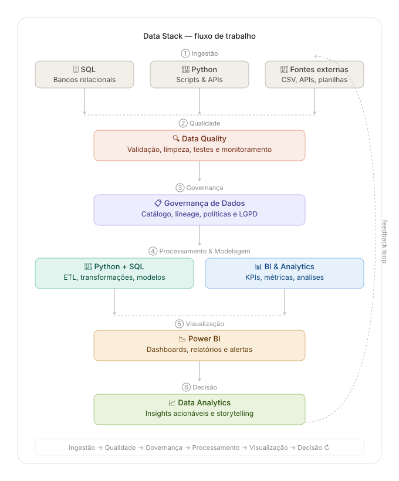
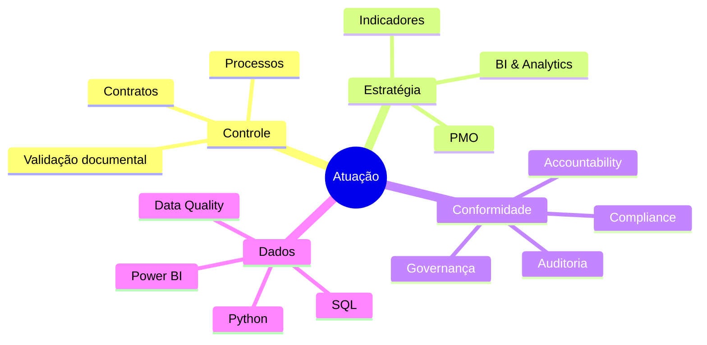

<!-- ═══════════════════════════════════════════════════════════
     GITHUB PROFILE README
     ═══════════════════════════════════════════════════════════ -->

<div align="center">

<!-- Banner -->


<br/><br/>

<!-- Typing animation header -->
[](https://git.io/typing-svg)

<br/>

<!-- Badges de área -->


</div>

---

## 🗂️ Sobre

Profissional com trajetória consolidada em **governança corporativa**, **gestão de contratos**, **compliance** e **inteligência de dados**. Atuo na interseção entre processos, tecnologia e conformidade — transformando complexidade em clareza, riscos em controles e dados em decisões.

> *"Excelência operacional com foco em resultado, conformidade e transparência."*

---

## 🔁 Fluxo de Trabalho

<div align="center">
  
</div>

---

## 🧩 Competências

<table>
  <tr>
    <td width="50%">

### 📄 Contratos
- Elaboração, análise e revisão contratual
- Gestão de vigências e alertas de vencimento
- Controle de aditivos e reajustes
- Interface com jurídico e fornecedores

    </td>
    <td width="50%">

### 🔍 Accountability & Auditoria
- Prestação de contas e transparência corporativa
- Condução e suporte a auditorias internas e externas
- Monitoramento de indicadores e conformidade com metas
- Registro e rastreabilidade de decisões e processos

    </td>
  </tr>
  <tr>
    <td>

### ✅ Validação Documental
- Conferência e autenticação de documentos
- Checklist estruturado por tipo de processo
- Rastreabilidade e versionamento
- Conformidade com normas internas

    </td>
    <td>

### 🗃️ PMO
- Gestão de portfólio e projetos estratégicos
- Cronogramas, escopo e controle de mudanças
- Status reporting para alta liderança
- Metodologias ágeis e waterfall

    </td>
  </tr>
  <tr>
    <td>

### 🛡️ Governança
- Governança de dados e políticas corporativas
- Prestação de contas e transparência
- Gestão de riscos corporativos (GRC)

    </td>
    <td>

### 📊 Indicadores
- Construção e gestão de KPIs estratégicos
- Dashboards executivos e operacionais
- Monitoramento de metas e SLAs
- Análise de desvios e planos de ação

    </td>
  </tr>
  <tr>
    <td>

### ⚙️ Controle de Processos
- Mapeamento AS-IS / TO-BE
- Melhoria contínua e controle e monitoramento
- Elaboração de POPs e normativos

    </td>
    <td>

### ⚖️ Compliance
- Aderência à LGPD e marcos regulatórios
- Condução de auditorias internas
- Matriz de riscos e controles
- Treinamento e cultura de conformidade

    </td>
  </tr>
</table>

---

## 🛠️ Stack de Ferramentas

<div align="center">


</div>

---

## 📈 Data Stack

```
📥 Ingestão          SQL · Python · APIs · CSV · Planilhas
       │
🔍 Data Quality      Validação · Limpeza · Testes · Monitoramento
       │
📋 Governança        Catálogo · Lineage · Políticas · LGPD
       │
⚙️  Processamento    ETL · Transformações · Modelagem · KPIs
       │
📉 Visualização      Power BI · Dashboards · Relatórios · Alertas
       │
📈 Decisão           Insights · Storytelling · Ações estratégicas
       ↑_________________________________________________↩ feedback loop
```

---

## 🏆 Áreas de Atuação



---

## 📬 Contato

<div align="center">

[](https://linkedin.com/in/cláudia-maria-duarte-ramos-17b1151a2/)
[](mailto:claudiaejoseantonio@gmail.com)

<br/>


</div>

---

<div align="center">
  <sub>Feito com 💚 · Governança · Compliance · Dados · Resultados</sub>
</div>
